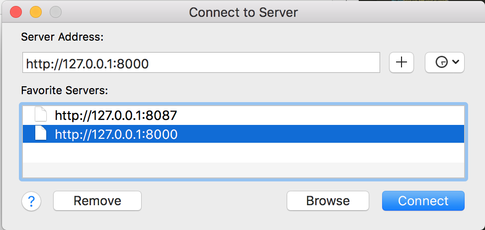
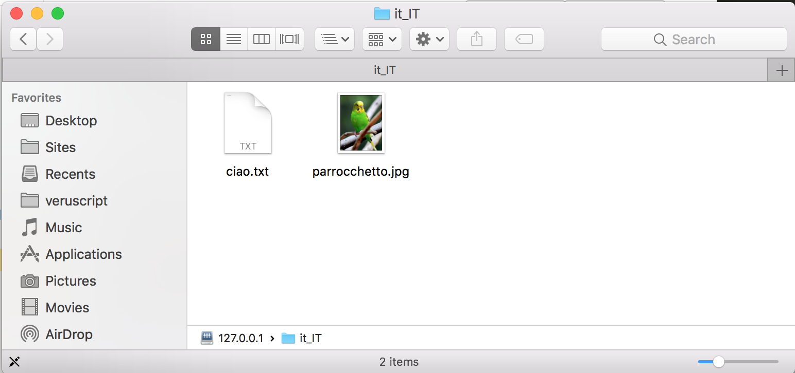
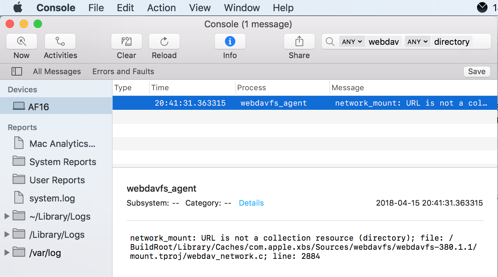

Codename "Airship" - WebDAV Server implementation in Symfony Flex 
==================================================================

**NOT FOR PRODUCTION USE!**

Background
----------

I wanted to host my own calendars and contacts but not using a third-party service.
So instead of using Google, iCloud, etc, I could use a self-hosted solution like
ownCloud or Nextcloud.
 
 
So... why not just use ownCloud or Nextcloud ?
----------
 
Since they are written in PHP and I am a PHP developer,
I would also benefit from understanding how to extend these tools. In order to do
that, I would need to understand how WebDAV works by implementing my own server
based on Symfony Flex.

What's the point?
----------

Other than gain better understanding, the documentation currently out there for WebDAV
is crap - just a plain text RFC, outdated or incomplete articles, and a lack of examples.
So by working on this project, I'd have a lot of content and tutorials I can create.

What's next?
------

 * Implement the RFC for WebDAV as fully as possible.
 * Test with clients other than Apple Finder.
 * Check known vulnerabilities in WebDAV.
 * Full auditing of request/response cycles.
 * Use PSR-7 and PSR-15.
 * Extend react/http.
 * Allow it to be used standalone, and with Slim, Laravel, Expressive, etc.
 * Implement CalDAV and CardDAV.
 * Create a client in PHP.
 * Create a Gaufrette Adaptor for WebDAV.
 * Create a Flysystem Adaptor for WebDAV.
 * Possibly flesh out this project as a full web application like ownCloud ???

Example requests and responses.
------

Some have been saved in this project within the `var/http` directory.
Any requests and responses will be saved here, done by the `HttpListener` class.

The Filesystem.
------

All files inside `var/files` will be exposed to WebDAV clients.

Using the built in PHP / Symfony web server to run the WebDAV server.
------

Although you can use:

    $ bin/console server:run

And connect to http://127.0.0.1:8080 in the client, and it may somewhat work,
bare in mind that WebDAV is designed to work on top of HTTP 1.1, but the
PHP Built-in Web Server sends HTTP 1.0 responses. 

Connecting and debugging the WebDAV server with macOS Finder.
------

1. Connect to Server as Guest.

2. Browse and download files.

3. Any errors Finder encounters will be logged in the console
- this part of macOS is open source, so you maybe able to get
a line number in a webdav_network.c where the error occurs for example.

Useful resources
-----

1. [RFC 4918, of course][1]!

2. [Microsoft on WebDAV][2]

3. [REST & WOA Wiki on PROPFIND][3]

4. [Why the Apple Finder is OK but not that great for WebDAV (but it's free!)][4]

5. [C code of WebDAV client implemented in macOS][5]

6. [RFC 5689 Extended MKCOL][6]

7. [Yandex WebDAV API][7]

[1]: https://tools.ietf.org/html/rfc4918#section-10.2
[2]: https://msdn.microsoft.com/en-us/library/ms977859.aspx
[3]: https://restpatterns.mindtouch.us/HTTP_Methods/PROPFIND
[4]: http://sabre.io/dav/clients/finder/
[5]: https://opensource.apple.com/source/webdavfs/webdavfs-352/mount.tproj/webdav_network.c.auto.html
[6]: https://www.ietf.org/rfc/rfc5689.txt
[7]: https://tech.yandex.com/disk/doc/dg/reference/propfind_contains-request-docpage/

[101]: https://github.com/mnutt/davros/issues/74
